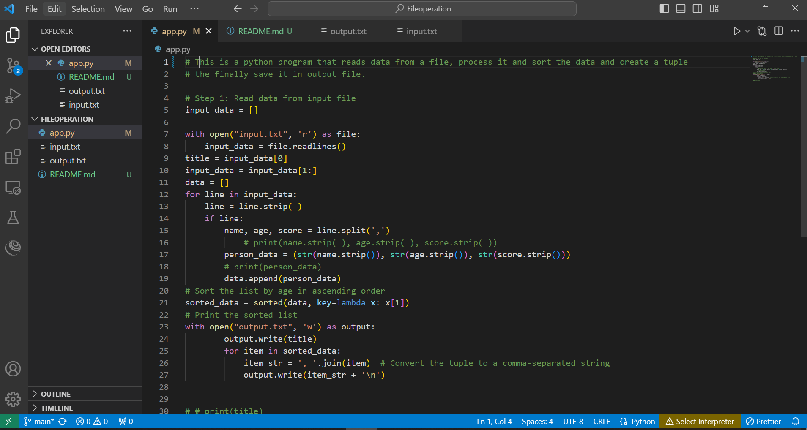
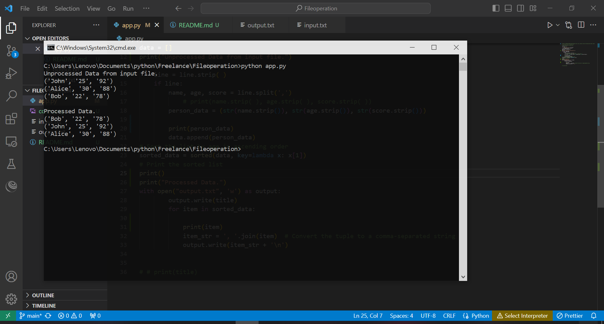

# A simple python program

This is a python program that reads data from a file, process it and sort the data and create a tuple the finally save it in output file.

## APPLICATION FUNCTIONALITIES:

1. Read data from a text file
2. Process the data
    - Create a tuple from the data read
    - Sort the data based on age
3. Store the processed data into a new output text file

### Project image

## How to run the program code
- Open command prompt from a folder containing the python file and input.txt
- run `python3 app.py`

